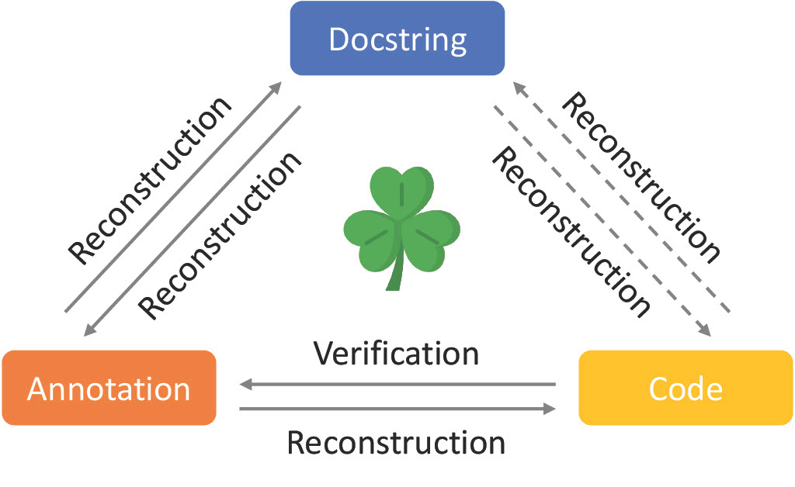

# Clover: Closed-Loop Verifiable Code Generation [[paper](https://arxiv.org/abs/2310.17807)]

<p align="center">

</p>

## Abstract
The use of large language models for code generation is a rapidly growing trend in software development. 
However, without effective methods for ensuring the correctness of generated code, this trend could lead to any number of undesirable outcomes. 
In this paper, we lay out a vision for addressing this challenge: the Clover paradigm, short for Closed-Loop Verifiable Code Generation, 
which reduces correctness checking to the more accessible problem of consistency checking. At the core of Clover lies a checker 
that performs consistency checks among code, docstrings, and formal annotations. The checker is implemented using a novel integration of formal verification tools and large language models. We provide a theoretical analysis to support our thesis that Clover should be effective at consistency checking. 
We also empirically investigate its feasibility on a hand-designed dataset (CloverBench) featuring annotated Dafny programs
 at a textbook level of difficulty. Experimental results show that for this dataset, (i) LLMs are reasonably successful at 
 automatically generating formal specifications; and (ii) our consistency checker achieves a promising acceptance rate 
 (up to 87%) for correct instances while maintaining zero tolerance for incorrect ones (no false positives).


## Install requirements
Install [sglang](https://github.com/sgl-project/sglang)
```
pip install "sglang[openai]"
```
Set the OpenAI API Key
```
export OPENAI_API_KEY=sk-******
```
### Run Experiments
```
cd clover
python3 exps.py --num-trial 50 --dafny-path [DAFNY_PATH]
```
Will receive 87% acceptance rate on CloverBench (Ground-Truth) dataset with gpt-4-1106-preview in March 2024.


## Citation
```bibtex
@misc{sun2023clover,
      title={Clover: Closed-Loop Verifiable Code Generation}, 
      author={Chuyue Sun and Ying Sheng and Oded Padon and Clark Barrett},
      year={2023},
      eprint={2310.17807},
      archivePrefix={arXiv},
      primaryClass={cs.SE}
}
```
